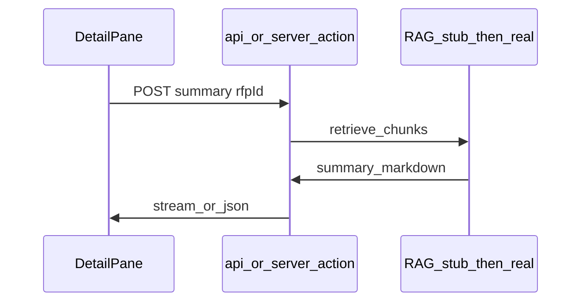

# Frontend implementation plan (Issues #13–#15)

This document is the **canonical planning spec** for the Next.js client described in GitHub Issues [#13](https://github.com/StanfordCS194/spr26-Team-6/issues/13), [#14](https://github.com/StanfordCS194/spr26-Team-6/issues/14), and [#15](https://github.com/StanfordCS194/spr26-Team-6/issues/15). It aligns with the wiki [System architecture](https://github.com/StanfordCS194/spr26-Team-6/wiki/System-Architecture) and the [Frontend and wiki rollout plan](https://github.com/StanfordCS194/spr26-Team-6/wiki/Frontend-and-Wiki-Rollout-Plan) (wiki mirror of the **code ↔ wiki sync** rules below).

**Current repo state:** `main` ships a static prototype (`index.html`, `script.js`, `styles.css`) with mocked RFPs. Target stack for issues **#13–#15** is **Next.js (App Router)** per wiki, replacing or superseding the static bundle as the primary app surface.

---

## Code change ↔ wiki update matrix

Every PR that lands frontend behavior for an issue **must** include the wiki edits in the same row (same PR, or a paired wiki PR merged immediately after—prefer same sprint).

| GitHub issue | Code deliverable (summary) | Wiki pages to update (required) |
|--------------|----------------------------|----------------------------------|
| **#13** Sidebar | Next.js root layout, `RfpCard`, scrollable list, global header (search + profile affordance), filter state (URL or store) | [System Architecture](https://github.com/StanfordCS194/spr26-Team-6/wiki/System-Architecture) — UI subgraph / score cache note if list source changes; [Frontend and wiki rollout plan](https://github.com/StanfordCS194/spr26-Team-6/wiki/Frontend-and-Wiki-Rollout-Plan) — checklist #13 |
| **#14** Detail Window | Detail pane empty vs selected states, action bar, SOW viewer, analysis tab, optional stretch “Draft proposal” | System Architecture — sequence diagram if RAG/summary path changes; rollout plan — checklist #14 |
| **#15** Profile | Profile drawer/page, capability forms, saved RFPs grid, stretch URL ingest | System Architecture — `CONTRACTOR` / `SAVED_PROJECT` bullets if fields change; rollout plan — checklist #15 |

Optional when behavior stabilizes: add a screenshot or short Loom to [Customer Discovery Summary](https://github.com/StanfordCS194/spr26-Team-6/wiki/Customer-Discovery-Summary) prototype section (instrumentation TODOs there still apply).

---

## Shared foundations (all issues)

- **Routing:** `app/(dashboard)/layout.tsx` owns the persistent shell (header + two-column body). Child `page.tsx` may stay minimal so layout survives navigations.
- **Data types:** Align UI models with wiki ER sketch: `RfpListItem` (id, title, agency/department display, dueDate, contractAmount, tags, compatibilityScore), `RfpDetail` extends list item + `sowMarkdown` (or lazy-loaded), `ScoreBreakdown` (optional structured explainability), `ContractorProfile`, `SavedRfp`.
- **Server vs client:** List + detail can start as Server Components fed by mock `lib/data/*.ts`; interactive filters, drawer, and streaming summary actions move to Client Components with clear boundaries.
- **API placeholders:** `POST /api/rfps/[id]/summary`, `POST /api/rfps/[id]/save`, `POST /api/profile` (or Server Actions) return stubs until RAG and DB exist; UI wires first so Issue acceptance is visual + contract, not model quality.
- **Auth:** Out of scope for #13–#15 unless PRD demands it; use a single mock “contractor” id in profile and saved state.

---

## Issue #13 — Sidebar (architecture)

**Goal:** Persistent high-density left rail + global header per issue body.

### Layout

- CSS grid or flex: **`minmax(280px, 30%)` | `1fr`** (or 20/80 per product preference). Header spans full width above the split.
- **Regions:** `GlobalHeader` (brand/title, `SearchInput`, `ProfileTrigger`), `Sidebar` (`FilterBar` optional in v1, `VirtualizedList` or simple scroll `RfpCard[]`).

### Components

| Component | Responsibility |
|-----------|----------------|
| `RfpCard` | Title, agency line, circular score, contract value, due date; `aria-pressed` / selected state; keyboard support |
| `RfpList` | Maps `RfpListItem[]`, forwards selection to parent |
| `MainLayout` | Holds `selectedRfpId` in URL (`?rfp=`) or React context to unblock #14 without prop drilling |

### State & navigation

- **Selection:** Prefer **`?rfp=<uuid>`** so detail view is deep-linkable and matches future server fetch by id.
- **Filters (v1):** Local state; **v2:** sync to URL `?tags=&geo=&sort=` and document in wiki System Architecture “Filters” edge.

### Wiki tie-in when merging #13

- Confirm System Architecture diagram text still matches column ratio and named regions (Sidebar / Detail / Profile).
- Rollout plan: mark #13 checklist done; note any deviation from 30/70 vs 20/80.

---

## Issue #14 — Detail Window (architecture)

**Goal:** Right pane: empty state vs loaded RFP; action bar; content hierarchy; stretch draft proposal.

### States

1. **`idle`:** No `rfp` query param → “Select an RFP” illustration + short copy.
2. **`loaded`:** Valid id → fetch detail (mock then API).

### Regions (top → bottom)

- **Action bar:** Save (writes `SAVED_PROJECT` stub), Generate Summary (calls summary endpoint / Server Action with loading + error toast), stretch **Draft proposal** (feature flag).
- **Header block:** Title + agency (canonical name when backend supplies it).
- **Body:** `SOWViewer` — `react-markdown` or sanitized HTML from extracted SOW.
- **Secondary column / tabs:** “AI analysis” — gap analysis + score breakdown components; lazy-load when tab selected.

### Data flow (summary)

### Wiki tie-in when merging #14

- If the on-demand summary flow differs from [System Architecture amendment sequence](https://github.com/StanfordCS194/spr26-Team-6/wiki/System-Architecture#amendment-and-summary-flow-sequence), update that mermaid block or add a “UI-triggered summary” note.
- Rollout plan #14 checklist; document stub vs live RAG.

---

## Issue #15 — Profile (architecture)

**Goal:** Contractor capability surface + saved opportunities; stretch URL ingest.

### UX pattern

- **Drawer (slide-over)** from right on desktop; full **route** `app/(dashboard)/profile/page.tsx` on small screens if simpler—pick one and document in wiki.

### Forms → model

| UI field | Maps to |
|----------|---------|
| Industries, sub-industries, goals | `CONTRACTOR` text fields (later structured tags) |
| Past experience narrative | `PAST_PERFORMANCE` or embedded profile blob until normalized |
| Saved RFPs grid | `SAVED_PROJECT` joined with `RFP` list items |

### Saved RFPs

- Reuse `RfpCard` in compact mode or a `SavedRfpTile` variant (same data shape as sidebar).
- Mutations: optimistic remove on unsave; sync when #14 Save and #15 grid share cache (React context or TanStack Query later).

### Stretch: URL ingest

- Isolated `POST /api/profile/ingest-url` — LLM parses public page → proposed field deltas; user confirms before apply. Document as “stretch” in wiki only when code exists behind a flag.

### Wiki tie-in when merging #15

- Update **Core data model** prose in System Architecture if new `CONTRACTOR` fields appear.
- Rollout plan #15 checklist; link to PRD Google Doc section for profile requirements if IDs exist.

---

## Suggested implementation order

1. **#13** — Shell + list + selection contract (unblocks #14).
2. **#14** — Detail + actions (depends on selection).
3. **#15** — Profile + saved list (can parallelize UI shell early but complete after Save from #14 works against shared state).

---

## PRD reference

Product requirements live in the [PRD Google Doc](https://docs.google.com/document/d/1gPhUZhes5RaExsT8kO_iatGe0guwdGa-rwMv7tH2UgE/edit?usp=sharing). When closing an issue, add a comment on the GitHub issue citing the PRD section satisfied (or explicitly flag a PRD gap).
